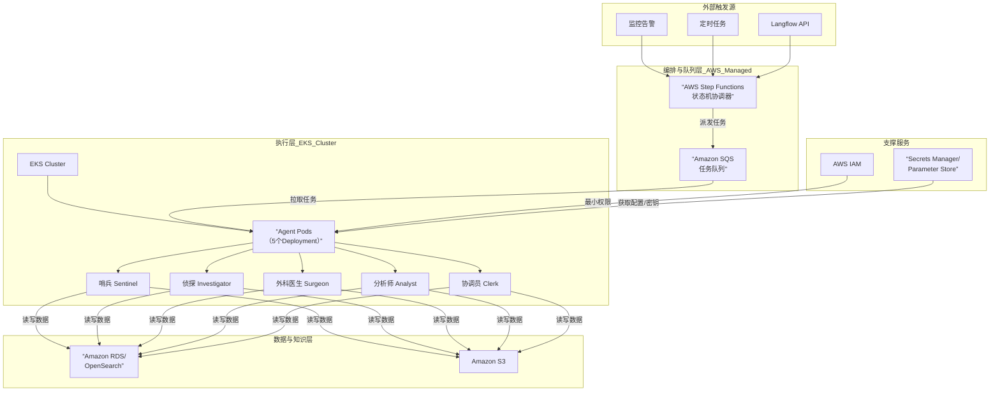
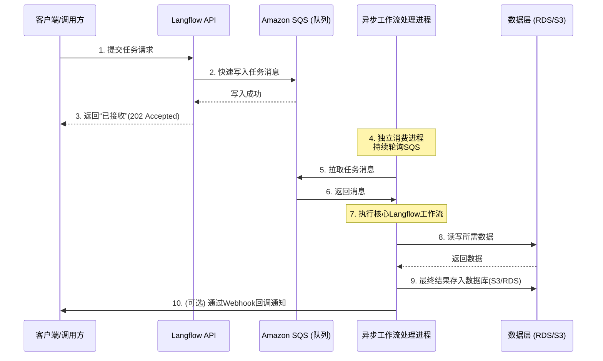

# SRE 的agent 体系设计
对于SRE 问题，我们认为应当设计这样的agent 功能
Agent 角色	核心使命	关键功能 (ReAct中的“Act”部分)	必需的工具/技能 (Tools)	必需的知识/数据 (Knowledge)
哨兵 (Sentinel Agent)	持续感知与异常发现	1. 查询：从监控系统拉取指标。
2. 分析：判断是否触发告警规则或发现异常模式。
3. 上报：创建初步事件单，并传递给“侦探”。	监控平台API（Prometheus, Datadog）、日志查询工具（ELK）、基础告警规则库。	系统基线指标（如CPU/内存正常范围）、关键业务SLO定义。
侦探 (Investigator Agent)	根因分析与影响评估	1. 关联：聚合日志、指标、链路追踪数据。
2. 推理：运用思维链进行假设、验证，定位故障点。
3. 总结：生成根因分析报告，评估影响范围。	日志/链路查询工具、服务依赖图谱、指标关联分析工具。	故障模式知识库（历史案例）、系统架构图、服务关键性分级。
外科医生 (Surgeon Agent)	执行标准化补救操作	1. 诊断确认：验证“侦探”提供的根因。
2. 执行预案：执行已知、安全的修复命令（如重启服务、扩容、切换流量）。
3. 验证：检查补救动作是否生效。	K8s/云平台CLI、配置管理工具（Ansible）、服务管理API。	标准操作程序（SOP）库、应急预案手册、变更审批流程。
分析师 (Analyst Agent)	容量、性能与风险洞察	1. 趋势分析：分析资源使用率和性能趋势。
2. 预测：预测容量瓶颈和未来风险。
3. 建议：给出优化建议（扩容、调优、清理）。	时序数据分析工具、性能剖析工具、成本管理API。	性能基线、容量规划模型、资源成本数据。
4.   
```
flowchart TD
    subgraph A [事件与编排层]
        EB[Amazon EventBridge<br>事件总线/路由器]
        SF[AWS Step Functions<br>状态机/Workflow引擎]
    end

    subgraph B [智能体执行层 - Lambda函数]
        S[哨兵 Agent<br>（定时/事件触发）]
        I[侦探 Agent<br>（事件触发）]
        Sr[外科医生 Agent<br>（状态机任务）]
        R[路由协调器 Agent<br>（事件触发）]
    end

    subgraph C [持久化与知识层]
        DDB[(DynamoDB<br>上下文/状态存储)]
        S3[(S3 & Aurora<br>知识库与日志)]
    end

    subgraph D [安全执行层]
        EC2[EC2 Systems Manager<br>安全运维命令]
        ECS[ECS/Fargate<br>批处理任务]
    end

    %% 主要工作流路径
    S -- 发布初始告警事件 --> EB
    EB -- 路由事件 --> R
    R -- 触发并传递参数 --> SF
    SF -- 调用侦探步骤 --> I
    I -- 写入分析结果 --> DDB
    SF -- 基于结果判断 --> G{是否已知SOP?}
    G -- 是 --> SF
    subgraph SF_sub [状态机分支]
        SF -- 调用外科医生步骤 --> Sr
    end
    Sr -- 执行核准命令 --> EC2
    
    %% 数据流
    I -- 检索 --> S3
    Sr -- 检索SOP --> S3
    SF -- 记录检查点 --> DDB
```  

```
flowchart TD
    subgraph A [输入与驱动层]
        direction LR
        CWA[CloudWatch Alarm<br>监控告警]
        EB[Amazon EventBridge<br>事件路由器]
        SF[AWS Step Functions<br>状态机 / 工作流引擎]
    end
    
    subgraph B [Bedrock AgentCore 核心模块]
        direction TB
        subgraph B1 [Agent执行环境]
            RT[AgentCore Runtime]
        end
        subgraph B2 [能力与连接]
            MEM[AgentCore Memory<br>上下文与案例库]
            GW[AgentCore Gateway<br>集成监控、CMDB等工具]
            ID[AgentCore Identity<br>安全身份与权限]
            CI[AgentCore Code Interpreter<br>安全数据分析]
        end
        subgraph B3 [可观测性]
            OBS[AgentCore Observability<br>基于CloudWatch的可观测性]
        end
    end

    subgraph C [SRE智能体逻辑层]
        StrandsSDK[Strands Agents SDK<br>编排“哨兵”“侦探”等逻辑]
    end

    subgraph D [安全执行层]
        SSM[Systems Manager<br>执行安全命令]
    end

    %% 主要工作流
    CWA -- 发布告警事件 --> EB
    EB -- 触发工作流 --> SF
    SF -- 调用并传递参数 --> StrandsSDK

    StrandsSDK -- 部署与运行于 --> RT
    StrandsSDK -- 读写记忆与上下文 --> MEM
    StrandsSDK -- 安全调用工具 --> GW
    GW -- 受控操作 --> SSM
    
    ID -- 提供身份认证 --> GW
    CI -.->|可选: 数据分析| StrandsSDK

    %% 可观测性数据流
    RT -- 发送运行指标 --> OBS
    StrandsSDK -- 发送应用追踪 --> OBS
    OBS -- 数据汇聚至 --> CW[(CloudWatch)]

```
| Agent 角色 | 核心使命 | 关键功能 | 必备工具技能 | 必备知识数据 |
|-----------|----------|----------|---------------|---------------|
| **哨兵 (Sentinel Agent)** | 持续感知与异常发现 | 1. **指标查询**：从监控系统拉取关键指标与日志。<br>2. **异常检测**：应用阈值、基线算法判断是否触发告警规则。<br>3. **事件上报**：创建初步事件单，包含上下文信息并传递给“侦探”。 | 监控平台API（Prometheus, Datadog）、日志查询工具（ELK, Loki）、时序数据库查询语言。 | 系统基线指标（CPU/内存/磁盘正常范围）、业务SLO/SLI定义、告警抑制规则。 |
| **侦探 (Investigator Agent)** | 根因分析与影响评估 | 1. **数据关联**：聚合指标、日志、链路追踪数据，构建事件全景图。<br>2. **推理定位**：运用思维链进行假设生成与验证，定位故障根本原因。<br>3. **报告生成**：输出根因分析报告，明确影响范围与严重等级。 | 分布式追踪工具（Jaeger, Zipkin）、日志关联分析工具、服务依赖图谱查询接口。 | 系统架构图、历史故障模式知识库、服务关键性分级、常见故障排查路径。 |
| **外科医生 (Surgeon Agent)** | 执行标准化补救操作 | 1. **方案确认**：验证“侦探”的根因分析，确认符合执行条件。<br>2. **执行预案**：执行预定义的修复操作（重启、扩容、流量切换、回滚）。<br>3. **效果验证**：检查修复后指标是否恢复正常，记录操作日志。 | K8s/云平台CLI与API、配置管理工具（Ansible, Terraform）、服务治理接口。 | 标准操作程序（SOP）库、应急预案手册（Runbook）、变更审批流程、回滚检查点。 |
| **分析师 (Analyst Agent)** | 容量、性能与风险洞察 | 1. **趋势分析**：分析资源使用率、性能指标与成本数据的长期趋势。<br>2. **预测预警**：基于模型预测容量瓶颈与性能风险。<br>3. **优化建议**：给出架构优化、配置调优、资源调整等建议。 | 时序数据分析工具、性能剖析工具（pprof, FlameGraph）、成本管理平台API。 | 性能基线数据、容量规划模型、资源成本明细、架构演进路线图。 |
| **协调员 (Coordinator Agent)** | 自动化协作、知识沉淀与流程衔接 | 1. **通信协调**：自动生成并发送事件状态更新邮件/Slack消息给相关团队。<br>2. **文档生成**：基于“侦探”的分析报告和“外科医生”的操作日志，自动生成符合模板的事后分析报告初稿。<br>3. **任务管理**：将“分析师”的建议自动创建为工单，分配给负责人并跟踪进度。<br>4. **知识入库**：将处理完毕的事件、报告、新发现的模式结构化存储到知识库。 | 办公软件API（Google Workspace, Office 365）、协作工具API（Slack, Teams）、工单系统API（Jira, ServiceNow）、Wiki API（Confluence, Notion）。 | 团队通讯录、升级策略、报告模板、SLO定义文档、知识库分类结构。 |



